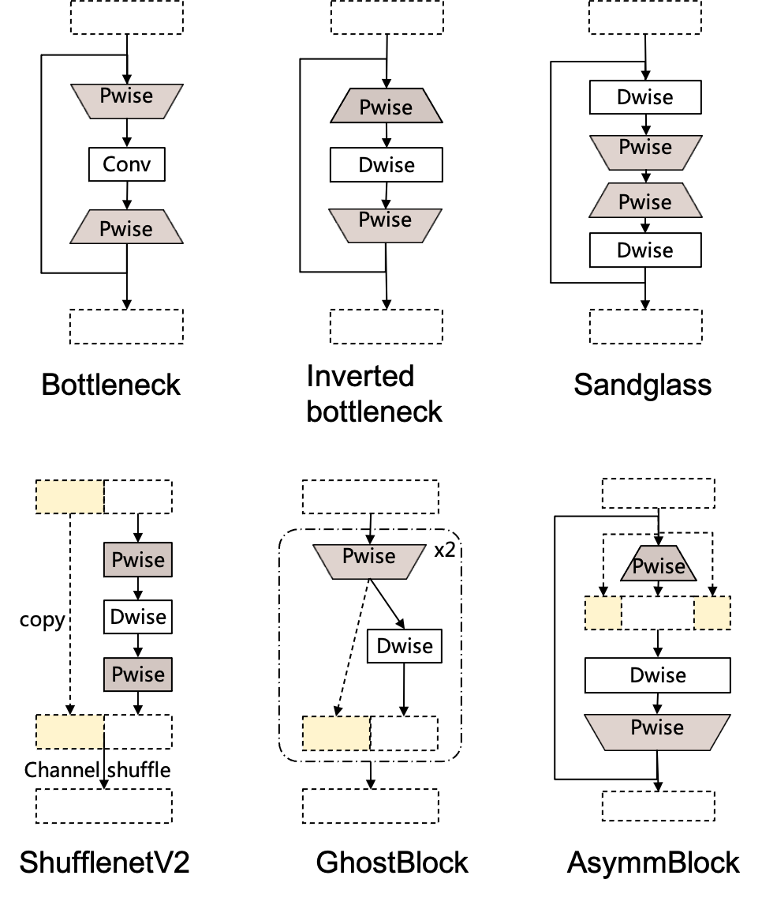

# AsymmNet
This repo is the official implementation with MXNet/Gluon for:
 * [AsymmNet: Towards ultralight convolution neural networks using asymmetrical bottlenecks](https://arxiv.org/abs/2104.07770) 

 Video presentation on YouTube: 
 * https://youtu.be/CMmZw8D15no

## What's New
* 2021.11.27 thanks [PaddlePaddle's implementation ](https://aistudio.csdn.net/62f9fab9b99b4c6e4e63d901.html)
* 2021.08.18 release MXNet trained `weight` && `log.txt` && `mac.txt`
* 2021.07.06 `pytorch` version released


## Block design


## Requirements
* Python \>= 3.6
* MXNet \>= 1.5.1
* GluonCV \>= 0.7.0
* mxboard \>= 0.1.0
* scipy
* tqdm
* portalocker


## What is included

```text
├── README.md
├── models
│   ├── asymmnet.py
│   ├── common.py
│   ├── ghostnet.py
│   ├── mobilenetv2.py
│   └── mobilenetv3.py
├── utils
│   ├── args_helper.py
│   ├── utils.py
│   └── visualization.py
└── train.py
```

## How to use

Referred [gluoncv_examples_classification](https://cv.gluon.ai/build/examples_classification/dive_deep_imagenet.html)

For training ImageNet
1. First, prepare data recordfile for ImageNet.
2. Training 

```text
export MXNET_SAFE_ACCUMULATION=1 && export MXNET_ENABLE_GPU_P2P=1
python train.py \
    --dataset imagenet \
    --rec-train /path/to/train.rec \
    --rec-train-idx /path/to/train.idx \
    --rec-val /path/to/val.rec \
    --rec-val-idx /path/to/val.idx \
    --batch-size 256 --model asymmnet_large \
    --mode hybrid --wd 0.00003 \
    --lr 2.6 --lr-mode cosine --num-epochs 360 --num-gpus 8 -j 48 \
    --warmup-epochs 5  --no-wd --last-gamma \
    --label-smoothing --width-scale 1.0 \
    --dtype float16 --dropout 0.1 \
    --tag-name 1.0x-fp16-8gpu-lr2.6-360e-drop0.1 \
    --log-interval 100
```

## Citation

```
@InProceedings{Yang_2021_CVPR,
    author    = {Yang, Haojin and Shen, Zhen and Zhao, Yucheng},
    title     = {AsymmNet: Towards Ultralight Convolution Neural Networks Using Asymmetrical Bottlenecks},
    booktitle = {Proceedings of the IEEE/CVF Conference on Computer Vision and Pattern Recognition (CVPR) Workshops},
    month     = {June},
    year      = {2021},
    pages     = {2339-2348}
}
```

## Reference
* [MeliusNet: Can Binary Neural Networks Achieve MobileNet-level Accuracy?](https://arxiv.org/abs/2001.05936)
* [Searching for MobileNetV3](https://arxiv.org/abs/1905.02244)
* [Densely Connected Convolutional Networks](https://arxiv.org/abs/1608.06993)
* [GhostNet: More Features from Cheap Operations](https://arxiv.org/abs/1911.11907)
